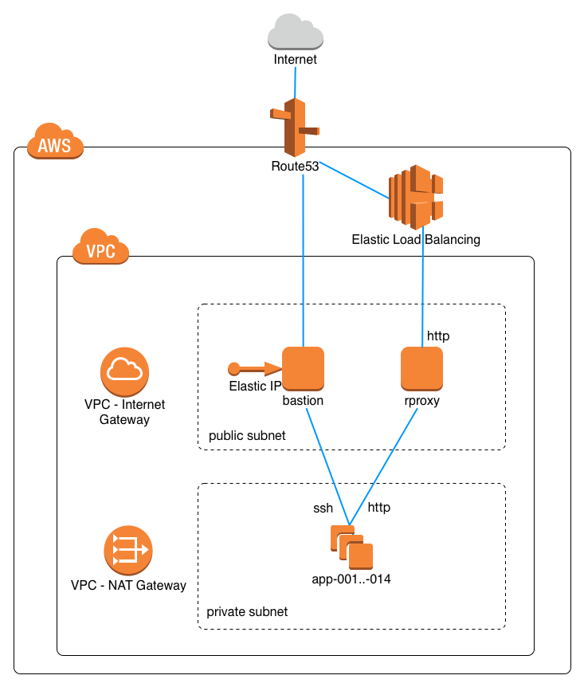

# Infrastructure as Code for Security Bootcamp in Speee Inc.

## Prepareing ~/.ssh/config

Append the contents of [config/ssh_config](./config/ssh_config) in your `~/.ssh/config`.
After that, you may be able to login bastion instance by `ssh bastion.speee-sbc`.

## Diagram

